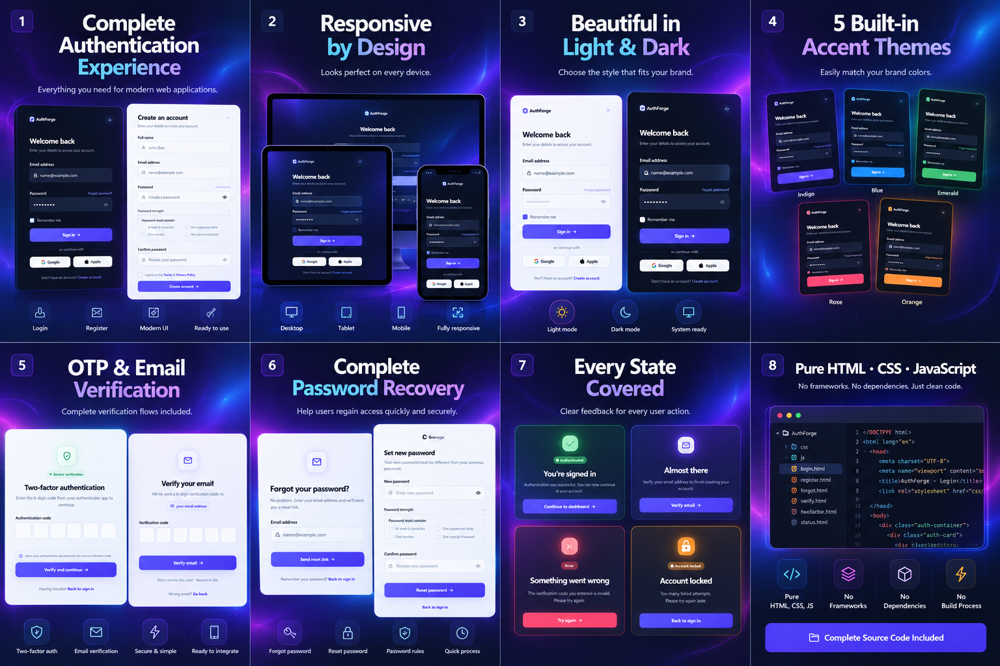
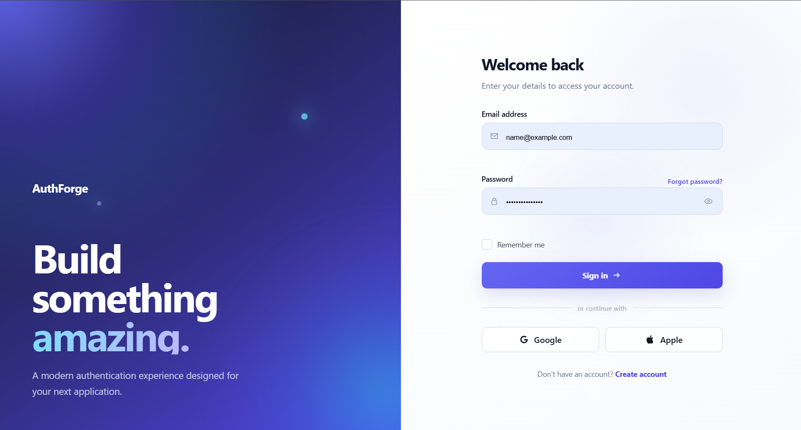
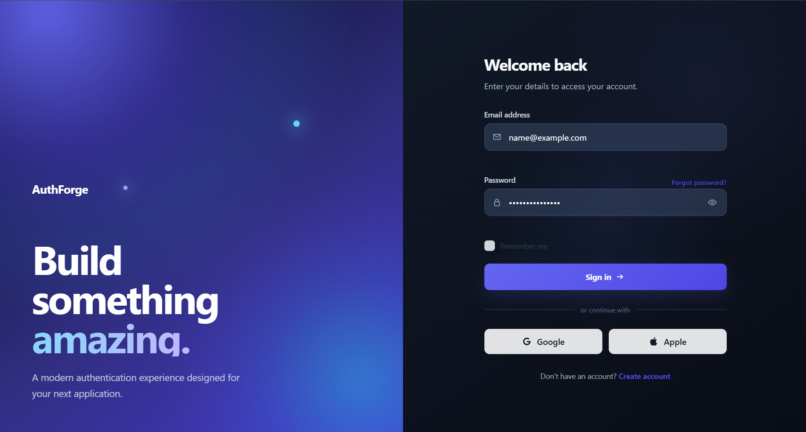
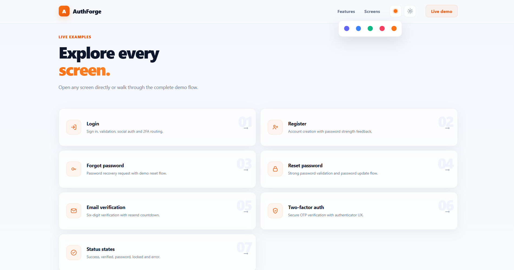
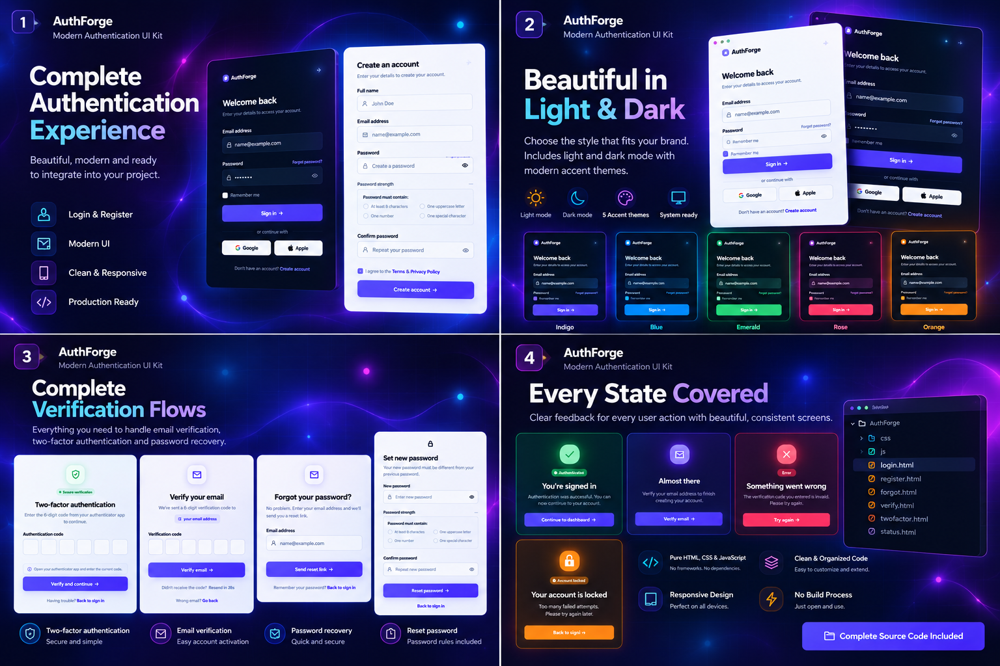

# AuthForge Aurora

A modern, responsive authentication UI kit built with **HTML, CSS and vanilla JavaScript**.

AuthForge Aurora is designed as a complete frontend authentication experience for SaaS products, dashboards and modern web applications.

---

## Preview

---

## Authentication Screens

Aurora includes a complete collection of authentication interfaces:

- Login
- Registration
- Forgot Password
- Reset Password
- Email Verification
- Two-Factor Authentication / OTP
- Reusable authentication status states

---

## Light & Dark Mode

Aurora supports **Light, Dark and System appearance modes** while maintaining a consistent layout and visual hierarchy.

| Light Mode | Dark Mode |
| --- | --- |
|  |  |

---

## Theme System

Aurora includes multiple accent themes:

- Indigo
- Blue
- Emerald
- Rose
- Orange

Theme and appearance preferences can persist between sessions.

---

## Features

- Fully responsive layouts
- Light, Dark and System modes
- Five accent themes
- Form validation
- Password strength feedback
- OTP input with keyboard and paste support
- Loading and error states
- Persistent theme preferences
- Reduced-motion accessibility support
- Backend-agnostic architecture
- Clean and organized frontend structure
- No frameworks
- No dependencies
- No package manager
- No build process

---

## Built With

- HTML5
- CSS3
- Vanilla JavaScript

---

## Backend Integration

AuthForge Aurora is a **frontend authentication UI kit**.

It is designed to be connected to an existing backend or authentication provider such as:

- ASP.NET Core
- Node.js
- Laravel
- Firebase
- Supabase
- Auth0

Server-side authentication, databases, email delivery and third-party OAuth configuration are not part of the frontend showcase.

---

## UI Showcase

---

## About AuthForge

**AuthForge** is focused on creating modern, polished and developer-friendly frontend UI templates for web applications.

The goal is to provide reusable frontend foundations with clean design, responsive layouts and practical developer integration in mind.

---

### AuthForge Aurora · v1.0

Modern authentication UI for modern products.
